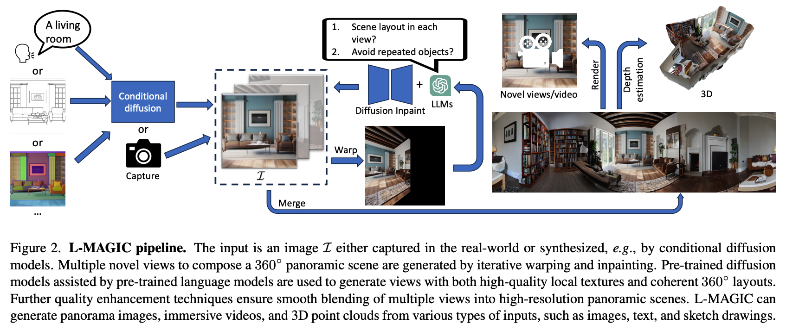
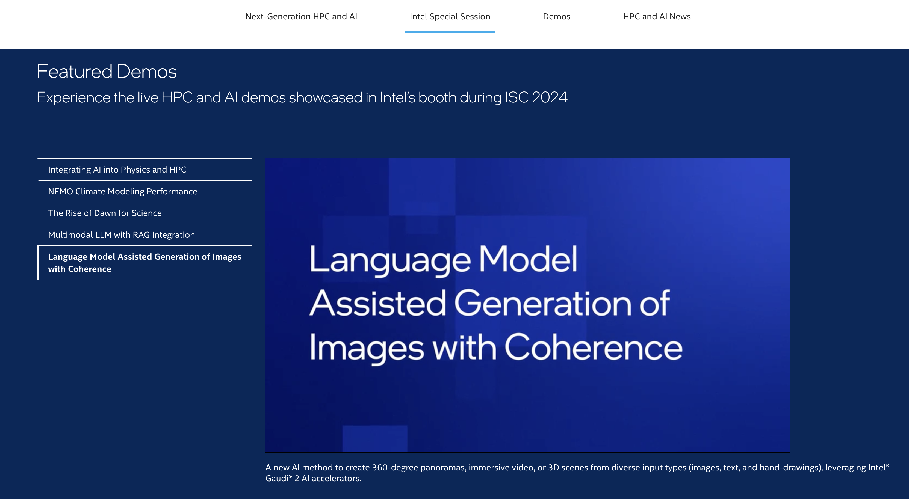

# [CVPR 2024] Official implementation of the paper: "L-MAGIC: Language Model Assisted Generation of Images with Coherence"
We present a novel method that can generate 360 degree panorama from different types of zero-shot inputs (e.g., a single image, text description, hand-drawing etc.)

<div align="center">
  
</div>

- [Paper](https://zhipengcai.github.io/MMPano/)
- [Project Page](https://zhipengcai.github.io/MMPano/)
- [Youtube Video](https://youtu.be/XDMNEzH4-Ec)
- [Huggingface demo (coming soon)](https://huggingface.co/spaces/MMPano/MMPano)

## Industrial Impact

Our work has been selected as **one of the 5 Intel featured live demos** at [ISC HPC 2024](https://www.intel.com/content/www/us/en/events/supercomputing.html). 

<div align="center">
  
</div>

## 📌 Reference

```bibtex
@inproceedings{
zhipeng2024lmagic,
title={L-MAGIC: Language Model Assisted Generation of Images with Coherence},
author={Zhipeng Cai and Matthias Müller and Reiner Birkl and Diana Wofk and Shao-Yen Tseng and JunDa Cheng and Gabriela Ben-Melech Stan and Vasudev Lal and Michael Paulitsch},
booktitle={The IEEE/CVF Conference on Computer Vision and Pattern Recognition},
year={2024}
}
```

## ⭐️ Show Your Support

If you find this project helpful or interesting, please consider giving it a star! Your support is greatly appreciated and helps others discover the project.

## Environment

This code has been tested on linux with python 3.9. It should be compatible with also other python versions.


## Run on Intel Gaudi

This codebase has been developed and deployed on Intel Gaudi on Intel Developer Cloud

- [Intel Gaudi](https://habana.ai/)
- [Intel Developer Cloud](https://www.intel.com/content/www/us/en/developer/tools/devcloud/overview.html)


#### Setup Docker environment
```bash
# Build docker image
./docker_build.sh

# Start the container. Following the instruction on the script, you may modify
# the `HABANA_VISIBLE_DEVICES` and `HABANA_VISIBLE_MODULES` to run on different Gaudi device.
./docker_run-hpu.sh
```


## Run on other device

You can also run it on Nvidia GPU. After a proper Nvidia environment setup with pytorch installed (ex: `conda`, `venv`, `docker` ...etc)

Install the necessary packages by running the following command:

```bash
pip install -r requirements.txt
```


## Run the code
#### Note
- If you are running on Gaudi, you will encouter a slower performance because Gaudi requires at least 2 warmup cycles. If you want to build your own application using this codebase, please to warmup the Gaudi at least 2 times.
  
- The best performance is enabled by using ChatGPT as the LLM controller, which requires you to apply for an [OpenAI API key](https://platform.openai.com/docs/overview).

- If you are in areas that cannot access the ChatGPT API, we also provided a way to use a free open sourced LLM controller (e.g., Llama3). Please see below for instructions on how to enable it. You may need to set the `HF_TOKEN` or pass a huggingface token. Feel free to also contribute to the code and enable other LLMs.

#### (Optional) Start a TGI LLM server

If user wants to use the TGI to do LLM serving, the code provides a script to pull the docker image and start a TGI LLM serving on Gaudi. Once the TGI is on, please make sure to pass `--llm_model_name tgi` when running the MM Pano command line in the next step.

We've only validated the listed LLM models ("meta-llama/Meta-Llama-3-8B-Instruct", "mistralai/Mistral-7B-Instruct-v0.2"). We encourage users to try out new models and add them to the supported list.

```bash
# Modify the model name and pass Huggingface token if needed. You can also change the `num_shard` if you like.
vi mm_pano/tgi_gaudi/run_tgi_gaudi.sh

# Pull and start the TGI-Gaudi in the container
(cd mm_pano/tgi_gaudi && ./run_tgi_gaudi.sh)
```

If user wants to run the TGI on other devices, please make sure the default TGI url:port is set to `http://127.0.0.1:8080`.


#### Command
There are different choices when running the code, a simple example for 

- image-to-panorama task
- ChatGPT LLM (GPT4)
- Gaudi accelerator as the hardware

```bash
python3 mm_pano/mmpano.py \
  --init_image exp/example/0.png \
  --output_folder exp/outputs \
  --dtype bfloat16 --device hpu \
  --llm_model_name gpt-4 \
  --api_key <your ChatGPT API key> \
  --save_pano_img \  # To save the generated panorama picture
  --gen_video  # To generate and save the video
```

To change the setups, e.g. 
- perform "text-to-panorama", change `--init_image exp/example/0.png` to `--init_prompt 'maple autum forest'`, also the `--init_prompt` can be used together with `--init_image` to provide a user specified scene description.
- use other LLMs, change `--llm_model_name gpt-4` to `--llm_model_name [other LLM names]`. Currently the available choices are `"gpt-4", "gpt-3.5-turbo", "meta-llama/Meta-Llama-3-8B-Instruct", "mistralai/Mistral-7B-Instruct-v0.2", "tgi"`,
  where TGI can be a [TGI Gaudi](https://github.com/huggingface/tgi-gaudi) or [TGI](https://github.com/huggingface/text-generation-inference) server to run bigger model like Llama3-70B. Note that the `--api_key` is only used for gpt models.
- use cuda, change `--device hpu` to `--device cuda`
- specify camera intrinsic for the input image, add `--intrinsitc float, float, float, float`

## Results

After running the code, you will see in the output_folder (exp/outputs) a panoramic image "pano.png" (see below for examples) and a immersive video "video.mp4".

<div align="center">
  
</div>

## Contact

Feel free to send an email to Zhipeng (czptc2h@gmail.com) or Joey (Tien Pei) Chou (joey.t.p.chou@gmail.com) if you have any questions and comments. 

## 📈 Star History

[](https://star-history.com/#IntelLabs/MMPano)
